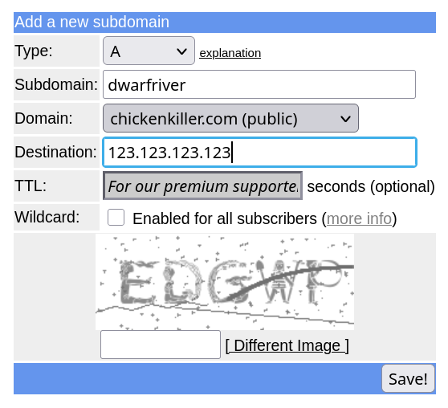

# Памятка

Здесь будут все шаги, от установки вплоть до использования.

## Установка

1. Покупаем какой-нибудь VPS/VDS-сервер. Выбор оного не входит в рамки туториала, страну лучше
   выбрать самую близкую к вам из соседних: Германия, Финляндия, Нидерланды.

2. Покупаем свой домен или берём бесплатный саб-домен. Я для подобных серверов использую
   [этот](https://freedns.afraid.org/subdomain/) сервис. Конкретно для него: регистрируемся,
   выбираем себе `Subdomain`, `Domain` из списка, вводим в поле `Destination` айпи вашего
   сервера, вводим капчу и нажимаем `Save!`. Примерно через минут десять DNS записи обновятся
   и можно будет подключиться к серверу по домену.

   

3. Подключаемся к серверу с помощью команды `ssh root@example.org` с вашими параметрами.
   То есть если вам выдали имя пользователя `root`, вы выбрали саб-домен `dwarfriver` и домен
   `mooo.com`, то команда будет выглядеть так: `ssh root@dwarfriver.mooo.com`. Когда вас
   попросят ввести пароль, вам может не показываться что что-то вводится, это нормально, ввод
   на самом деле продолжается.

4. Переходим в [Быстрый старт](README.ru.md#быстрый-старт) и исполняем команду, меняя домен
   `example.org` на свой, затем выходим с сервера с помощью команды `exit`. Примерный вывод
   после исполнения команды там также указан.

После всех этих шагов вы получите полностью рабочий прокси-сервер с веб-панелью по ссылке. В
ней вы и будете добавлять новых пользователей. ВАЖНО: **обязательно** сохраните где угодно эти
ссылку, имя пользователя и пароль. Без них вы не сможете попасть в панель в будущем.

## Как пользоваться панелькой

TODO

## Как пользоваться прокси-ссылкой

TODO
